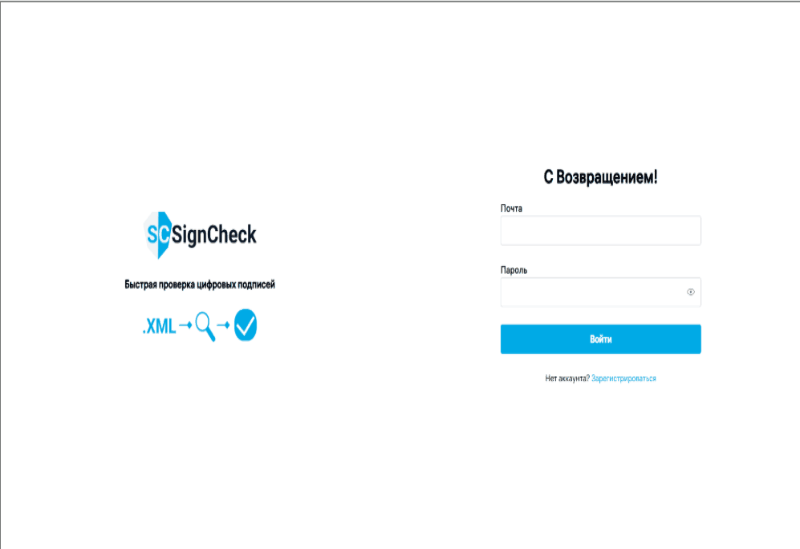
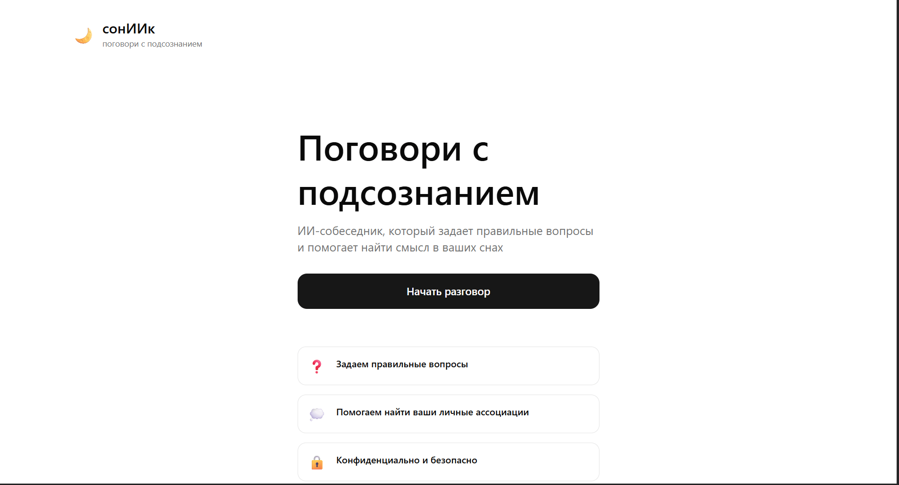
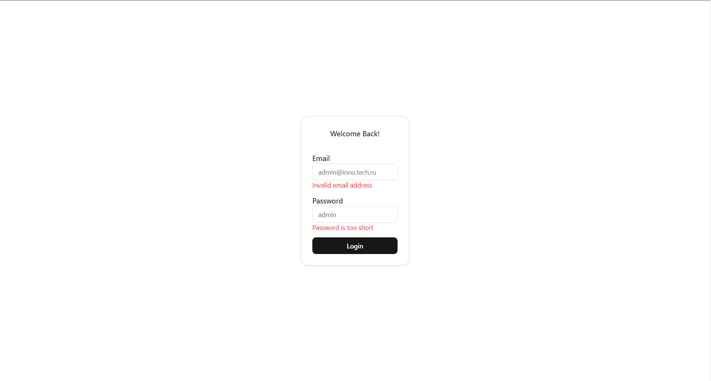
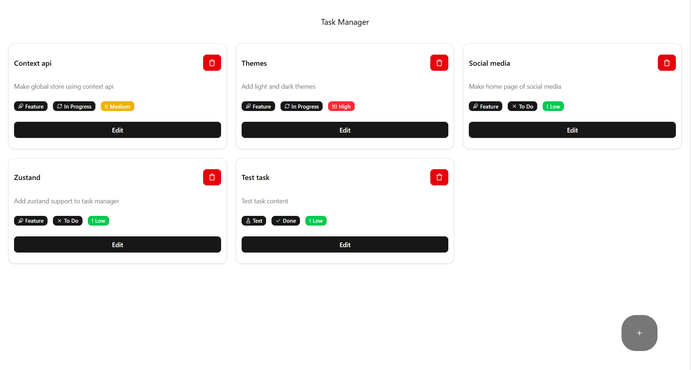

# Hi 👋, I'm Danil

**Frontend developer** with a passion for building modern web applications. Currently focused on full-stack development and expanding my skills in backend technologies.

## 🚀 Current Focus
- ✍️ Working on a **fullstack social media app**.
- 📚 Learning **Redis** and **Kafka** to enhance my backend knowledge.
- 🤝 Actively looking to **collaborate on open source projects**.

---

## 🔗 My Projects

Here are some of my recent projects, each built with TypeScript:

### [ds-checker-front](https://github.com/walledoll/ds-checker-front)
> A digital signature verification service. Users can upload documents, view XML content with syntax highlighting, manage a verification queue, and receive detailed reports.

### [dreams-chatbot-front](https://github.com/walledoll/dreams-chatbot-front)
> A responsive web chat for dream interpretation with voice input and personalized AI analysis.

### [dreams-chatbot-back](https://github.com/walledoll/dreams-chatbot-back)
> REST API for the dream analysis service, built with NestJS, Prisma, and PostgreSQL.

### [forms](https://github.com/walledoll/forms)
> A simple and user-friendly admin panel for managing user records: view, edit, create, and delete entries.

### [toDoList](https://github.com/walledoll/toDoList)
> A classic ToDo list application, perfect for learning and practicing state management and component architecture.

---

## 📊 GitHub Stats & Skills

---

## 💡 Technologies I Work With

---

## 📄 Resume & Experience

You can learn more about my professional background and experience here:  
👉 [My Resume](https://ufa.hh.ru/resume/dba85bc2ff0f5cef330039ed1f53324148516b)

---

## 📬 Let's Connect!

I'm always open to new opportunities and collaborations. Feel free to reach out!

