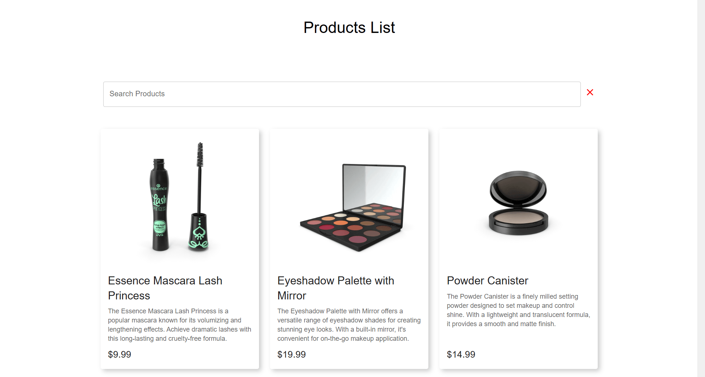
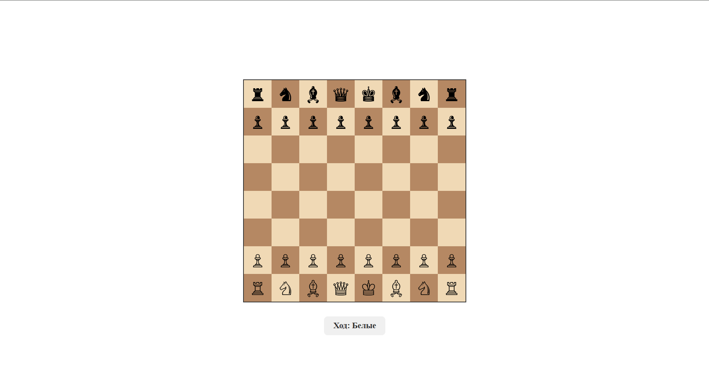
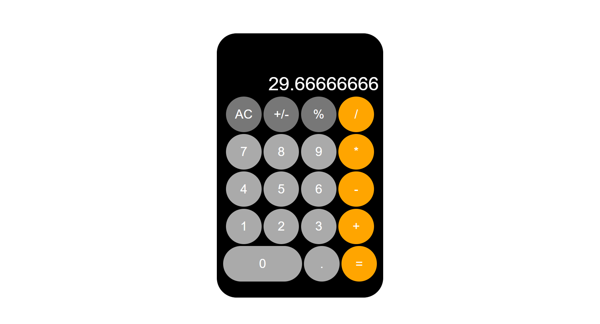

# Hi 👋, I'm Danil

**Frontend developer** with a passion for building modern web applications. Currently focused on full-stack development and expanding my skills in backend technologies.

## 🚀 Current Focus
- ✍️ Working on a **fullstack social media app**.
- 📚 Learning **Redis** and **Kafka** to enhance my backend knowledge.
- 🤝 Actively looking to **collaborate on open source projects**.

---

## 🔗 My Projects

### React + TypeScript

  <table>
    <tr>
      <td align="center" width="33%">
        
         
        <strong><a href="https://github.com/walledoll/store">Store</a></strong>
         
        E-commerce application with shopping cart
      </td>
      <td align="center" width="33%">
        
         
        <strong><a href="https://github.com/walledoll/chess">Chess</a></strong>
         
        Interactive chess game implementation
      </td>
      <td align="center" width="33%">
        
         
        <strong><a href="https://github.com/walledoll/ds-checker-front">DS Checker</a></strong>
         
        Digital signature verification service
      </td>
    </tr>
    <tr>
      <td align="center" width="33%">
        
         
        <strong><a href="https://github.com/walledoll/dreams-chatbot-front">Dreams Chatbot</a></strong>
         
        AI-powered dream interpretation chat
      </td>
      <td align="center" width="33%">
        
         
        <strong><a href="https://github.com/walledoll/forms">Forms Admin Panel</a></strong>
         
        User management admin interface
      </td>
      <td align="center" width="33%">
        
         
        <strong><a href="https://github.com/walledoll/toDoList">ToDo List</a></strong>
         
        Task management application
      </td>
    </tr>
  </table>

---

### Vanilla JavaScript

  
  
<strong><a href="https://github.com/walledoll/calculator">Calculator</a></strong>

  
A functional calculator built with pure JavaScript

---

## 📊 GitHub Stats & Skills

---

## 💡 Technologies I Work With

---

## 📄 Resume & Experience

You can learn more about my professional background and experience here:  
👉 [My Resume](https://ufa.hh.ru/resume/dba85bc2ff0f5cef330039ed1f53324148516b)

---

## 📬 Let's Connect!

I'm always open to new opportunities and collaborations. Feel free to reach out!

